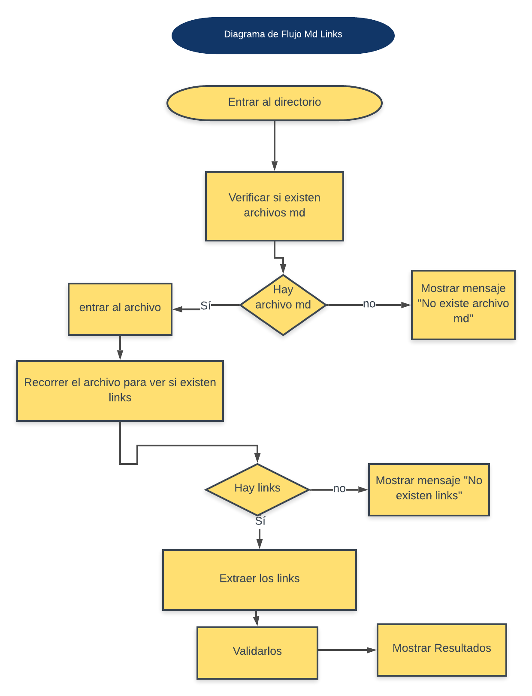

# MarkDown Links

MarkDown Links es un librería que le permitirá a los usuarios validar el estado de los enlaces en los archivos README.md de su proyecto.

# Diagrama de Flujo

# Instalación

Posicionese dentro de su carpeta y abra la terminal para colocar el siguiente comando:

`$ npm install susejr/md-links --save`

# Uso de la Librería

Para hacer uso de la librería debe linkearla:

`const mdLinks = require('md-links');`

`console.log(md-links);`

### Autora: Susej Rodríguez

